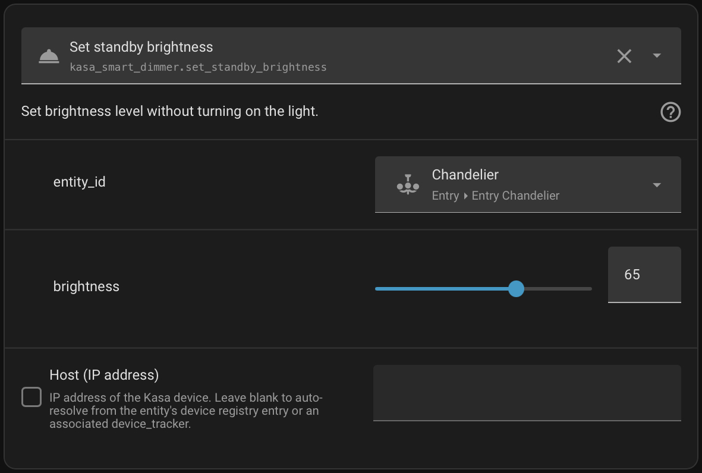

[](https://github.com/neznein9/Kasa-Smart-Dimmer-Add-on-for-Home-Assistant/releases/latest)
[](./LICENSE)
[](https://hacs.xyz)
[](https://github.com/neznein9/Kasa-Smart-Dimmer-Add-on-for-Home-Assistant/pulls)


# Kasa Smart Dimmer

## Integration for Home Assistant

This is a custom integration for [Home Assistant](https://www.home-assistant.io/) that adds extra actions for dimmer switches from [Kasa Smart](https://www.kasasmart.com/) and [Tapo](https://www.tapo.com/). See the [list of tested devices](#tested-devices) below.

This is **not** a full replacement integration; it is intended to work alongside the [TP-Link Smart Home](https://www.home-assistant.io/integrations/tplink/) integration to expose additional capabilities that Home Assistant does not currently surface.


## Features

- [x] Set a dimmer switch's standby brightness without turning on the light

## Installation

### HACS

Click the button to install via [HACS](https://hacs.xyz/):

[](https://my.home-assistant.io/redirect/hacs_repository/?owner=neznein9&repository=Kasa-Smart-Dimmer-Add-on-for-Home-Assistant&category=integration)

Or manually:

1. Open HACS
2. Go to **Integrations**
3. Open the three-dot menu
4. Select **Custom repositories**
5. Paste this repository URL
6. Set category to **Integration**
7. Install **Kasa Smart Dimmer**
8. Restart Home Assistant

### Manual Installation

Copy the `custom_components/kasa_smart_dimmer` directory from this repo into your `custom_components` config directory.

## Usage



Use the action to set a dimmer's brightness without turning on the light:

```yaml
action: kasa_smart_dimmer.set_standby_brightness
data:
  entity_id: light.en_suite_bathroom
  brightness: 90
```


## Tested Devices
- [x] ✅ [Kasa Smart KS220 - Smart Wi-Fi Dimmer Switch, HomeKit](https://www.kasasmart.com/us/products/smart-switches/kasa-smart-wifi-light-switch-dimmer-ks220)
- [ ] ❔ [Kasa Smart KS225 - Smart Wi-Fi Dimmer Switch, Matter](https://www.kasasmart.com/us/products/smart-switches/kasa-smart-wifi-light-switch-dimmer-ks225)
- [ ] ❔ [Tapo S500D Smart Wi-Fi Light Switch, Dimmer](https://www.tapo.com/us/product/smart-switch/tapo-s500d/)
- [ ] ❔ [Tapo S505D Smart Wi-Fi Light Switch, Dimmer, Matter](https://www.tapo.com/us/product/smart-switch/tapo-s505d/)
- [x] ✅ [Tapo S515D KIT Smart Wi-Fi Dimmer Light Switch, 3-Way Kit](https://www.tp-link.com/us/home-networking/smart-switch/tapo-s515d-kit/)


---

## Development
This integration is built on top of Home Assistant’s [TP-Link Smart Home](https://www.home-assistant.io/integrations/tplink/) integration and the [python-kasa](https://github.com/python-kasa/python-kasa) library. Many TP-Link devices expose additional functionality that is not visible in Home Assistant. Contributors interested in adding support for new devices or features are encouraged to inspect the live python-kasa device objects already managed by Home Assistant.

A useful starting point is obtaining the underlying device through an entity’s coordinator:
```
entity = entity_component.get_entity(entity_id)
device = entity.coordinator.device
await device.update()
```

Then, inspect:
```
device.modules
device.features
device.internal_state
```

The modules collection is often the most valuable source of information. For example, legacy Kasa dimmers expose a `smartlife.iot.dimmer` module, while newer Tapo dimmers expose modules such as Brightness, Light, LightPreset, and LightTransition. Examining available modules, their methods, and the underlying protocol calls can reveal hidden functionality.
